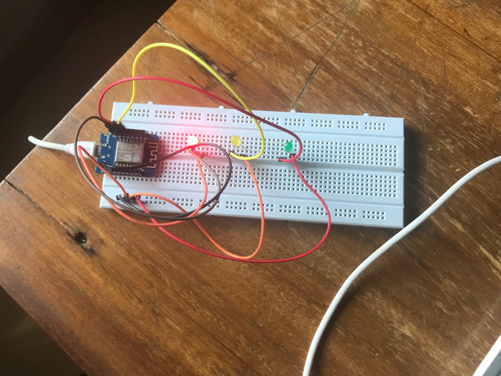

# Smart Traffic Signal Using Computer Vision

The aim of this project is to demonstrate how traffic signals can be equipped with computer vision so that these traffic signals communicate with each other via a centralized server and this server decides on the most optimal signal changes, compliant with a set of ground rules. These ground rules may be trivial but of extreme necessity like, you want to ensure no matter what the traffic conditions may be, once a signal is green it should remain so for a predefined period of time (10 seconds in our project demonstration).

## Hardware Components
1. WeMos D1 mini (microcontroller)
2. LEDs (red, yellow, green) for traffic lights
3. Connecting Wires
4. Breadboard
5. Resistors

## Software Requirements
1. Tensorflow Frozen Models
2. Arduino IDE
